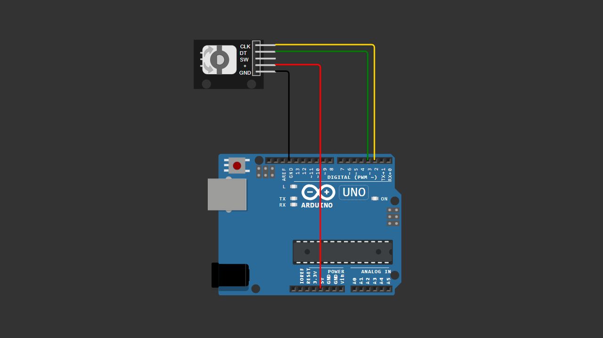

# Arduino Rotary Encoder Test

A beginner-friendly Arduino project demonstrating how to use a rotary encoder as a digital input device without using any external library.

This project detects rotation direction (clockwise and counterclockwise) and updates a counter value displayed on the Serial Monitor.

---

## 📌 Project Overview

Unlike a potentiometer that produces analog values (0–1023), a rotary encoder generates digital pulses.

By analyzing the signal sequence from the CLK and DT pins, Arduino can detect:

- Clockwise rotation → Counter increases  
- Counterclockwise rotation → Counter decreases  

This example is intentionally written without any external library to help beginners understand the core logic behind rotary encoders.

---

## 🧰 Components Required

- Arduino Uno / Nano  
- Rotary Encoder Module (CLK, DT, SW, +, GND)  
- Jumper Wires  
- Breadboard (optional)  

---

## 🔌 Wiring Connections

| Rotary Encoder | Arduino |
|---------------|----------|
| CLK           | Pin 2    |
| DT            | Pin 3    |
| SW            | Pin 4 (not used in this project) |
| +             | 5V       |
| GND           | GND      |

---

## 📷 Wiring Diagram

> Make sure your wiring matches the table above before uploading the code.

---

## 💻 Arduino Code

You can download the Arduino sketch here:

[Download Arduino Code](Arduino_Rotary_Encoder_Test.ino)

Or open the `.ino` file directly inside this repository.

---

## 🚀 Getting Started

1. Connect all components according to the wiring table.
2. Upload the provided Arduino sketch.
3. Open **Serial Monitor**.
4. Set baud rate to **9600**.
5. Rotate the encoder and observe the counter value change.

---

## 🧠 Learning Concepts

This project helps you understand:

- Digital input reading
- State change detection
- Direction detection logic
- Counter implementation
- Serial communication basics

---

## 🔄 Possible Improvements

You can expand this project by adding:

- LED brightness control (PWM)
- Servo motor control
- LCD display counter
- Menu navigation system
- Interrupt-based encoder reading (advanced)

---

## 🎥 Video Tutorial

Watch the full step-by-step tutorial on YouTube:

👉 https://youtu.be/QSZGTJiMycU

In this video, you will see:
- Complete wiring demonstration  
- Code explanation  
- Live rotation testing  
- Clockwise and counterclockwise direction detection  

If this project helps you, consider subscribing for more beginner-friendly Arduino tutorials 🚀

---

## 📄 License

This project is open-source and free to use for educational purposes.

---

Happy Coding 🚀

